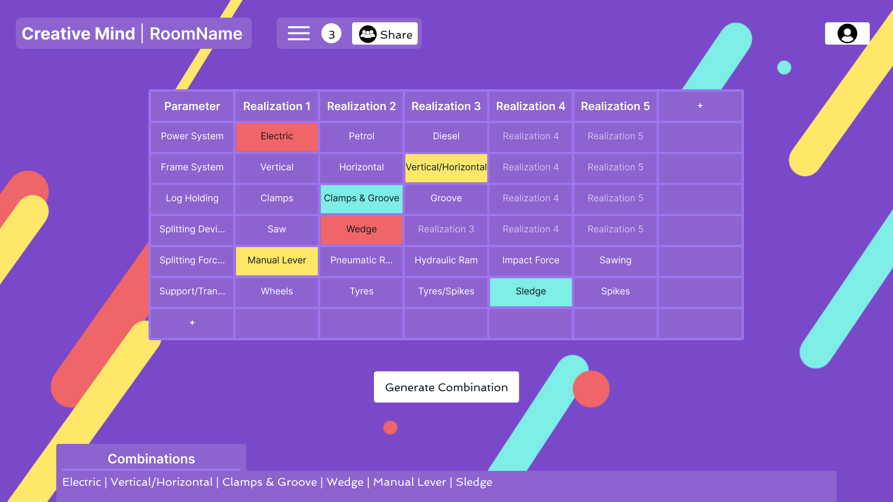

= Creative Minds 🌟  
Die digitale Umsetzung des morphologischen Kastens als Webanwendung.  

== 🌐 Über das Projekt  
Creative Minds ist eine innovative Webanwendung, die es ermöglicht, den morphologischen Kasten – ein bewährtes Kreativitätswerkzeug – digital zu nutzen.  
Die Plattform bietet eine intuitive Benutzeroberfläche, mit der Nutzer schnell und einfach neue Ideen und Lösungen generieren können.  

Ob für Produktdesign, Problemlösungen oder strategische Planung – Creative Minds hilft dabei, komplexe Probleme strukturiert zu analysieren und kreative Ansätze zu entwickeln.  

== 🎯 Ziel  
Unsere Mission ist es, die Flexibilität und Vielseitigkeit des morphologischen Kastens in die digitale Welt zu übertragen, um die Kreativität und Zusammenarbeit in Teams und bei Einzelpersonen zu fördern.  

== 🛠️ Funktionen  
* **Benutzerfreundliche Oberfläche**: Einfache Erstellung und Bearbeitung von morphologischen Kästen.  
* **Kollaboration**: Teile und bearbeite deine Kästen gemeinsam mit anderen.
* **Export & Import**: Sichere und teile Ergebnisse im PDF- oder CSV-Format.  
* **Account-Speicherung**: Zugriff auf deine Projekte von überall.  

== 🚀 Technologie-Stack  
* **Frontend**: Webpack für eine dynamische und reaktionsschnelle Benutzeroberfläche.  
* **Backend**: Leocloud für eine robuste Serverarchitektur.  
* **Datenbank**: Postgres zur Speicherung von Benutzer- und Projektdaten.  

== 📸 Vorschau

== 🚀 Projekt starten

1. Mit der virtuellen Maschine verbinden: 

  ssh cm

2. Keycloak starten:

  sudo systemctl start keycloak-23.0.6

3. Minikube starten: 
Navigiere in den Ordner `/backend/k8s` und führe aus:  

  minikube start

4. Datenbank starten und Port weiterleiten (5432:5432):  

  bash start-db.sh

5. Backend starten:  
Navigiere in den Ordner `/backend` und führe aus:  

  ssh start.sh

6. Frontend vorbereiten (optional):  
Navigiere in den Ordner `/frontend` und führe aus:  

  npm install

7. Frontend starten:  
Navigiere in den Ordner `/frontend` und führe aus:  

  npm start

8. Keycloak-Zugang:  
Besuche die Website (localhost:9000) und melde dich an. Die Anmeldedaten sind:  
* Benutzername: `testMember`  
* Passwort: `test123`
Oder registriere dich als neuer Nutzer.

