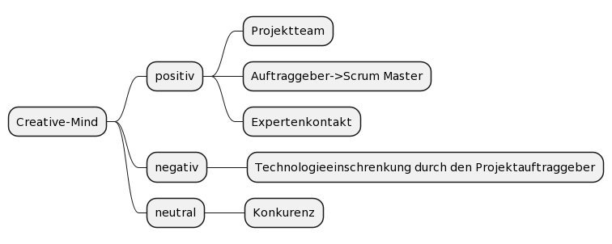

= Creative-Mind Umfeldanalyse
Stevan Vlajic
1.0.0, {docdate}
//:toc-placement!:  // prevents the generation of the doc at this position, so it can be printed afterwards
:icons: font
:sectnums:
:toc: left
:experimental:

=== Matrix der Faktoren

[cols="3,2,2,2"]
|===
|Einflussgröße |Sachlich/Sozial |Einfluss aufs Projekt |Einstellung zum Projekt

|Projektteam |sozial |hoch |Positiv
|Auftraggeber -> Scrum Master |sozial |hoch |Positiv
|Konkurrenz |sozial |hoch |Neutral
|Projektstrategie |sachlich |hoch |
|Kosten |sachlich |niedrig |
|Recht |sachlich |mittel |
|Ressourcenverfügbarkeit/Technische Infrastruktur |sachlich |hoch |
|Expertenkontakt |sozial |hoch |Positiv
|Technologieeinschränkung durch den Projektauftraggeber |sozial |hoch |Negativ
|Bildungsinstitution(Schule) |sachlich |hoch |
|===

=== Graphische Darstellung der sozialen Umfeldanalyse

