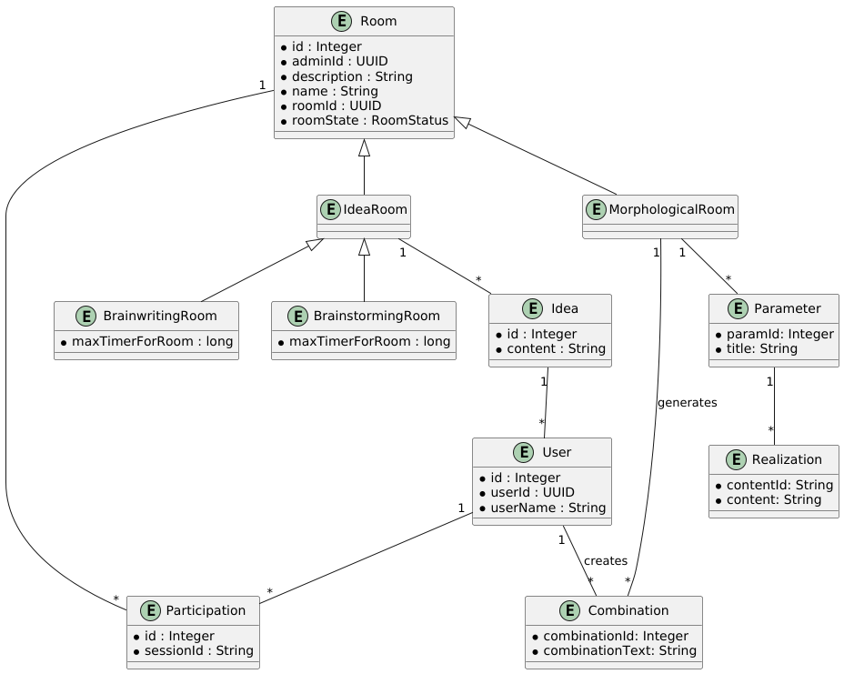

= Datenbank

== ERD

== Tabellenbeschreibungen

=== Room

Ein allgemeiner Raum ist die Basis für alle Räume und enthält die Informationen zum Ersteller (`adminId`), eine Beschreibung (`description`), den Raumstatus (roomState), die Id (nur in der Datenbank), die `roomId` (als UUID und für die Arbeit mit einem Unique Identifier für die Paths im Frontend) und den Namen (`name`).

Der Typ eines Raumes definiert sich in der Spalte roomType und legt fest, welche konkrete Klasse für den Raum verwendet werden muss.

RoomStatus kann folgende Werte annehmen:

* CREATED: neu angelegt
* OPEN: derzeit nicht verwendet
* STARTED: gestartet (vor allem für die zeitabhängigen IdeaRoom-Typen)
* STOPPED: gestoppt, kann wieder gestartet oder gelöscht werden.

=== IdeaRoom

Das sind alle Räume die mit Ideen arbeiten, also Ideen als `Idea` abspeichern. Derzeit sind das der

* *BrainwritingRoom* für die 6-3-5 Methode und der
* *BrainstormingRoom* für die gleichnamige Methode.

Der IdeaRoom ist nur Abstract im Backend als Basis für die Idea-Funktionen abgelegt. Hierin versteckt sich die Verbindung zu den Ideen, die aber mit der `roomId` aus dem Room verbunden sind.

=== User

Ist der Benutzer in der Applikation wir haben nur die Nutzer UUID aus Keycloak (`userId`), eine eigene `ID` in der Datenbank und einen Namen (`userName`) ebenfalls von Keycloak.

== Idea

Eine Idee (`content`) eines Benutzers (`userId`) in einem IdeaRoom (`roomId`). Ob die Idee angezeigt wird und wie, wird im Frontend implementiert. Es werden immer alle Ideen aus dem Backend ins Frontend geliefert.

== Participation

Um zu verwalten, welche User (`userId`) sich **gerade** in einem Raum (`roomId`) gibt es die Participation Tabelle. Diese wird durch die WebSocket-Verbindung erzeugt und so
