= Das Frontend

Das Frontend wird funktional im xref:../wireframe/wireframe.adoc[Wireframe] beschrieben. Die einzelnen Ansichten und Typen sind dort zu finden.

Die Funktionalität der xref:./websocket.adoc[Websockets] ist ebenfalls nicht hier sondern in der genannten Beschreibung zu finden.

== Die Struktur

=== SSOT (Single Source Of Truth)

Wir implementieren das SSOT-Konzept im Frontend mit dem `BehaviorSubject` von `rxjs` (siehe https://rxjs.dev/api/index/class/BehaviorSubject).

Verteilung von Veränderungen mit `produce` von `immer`.

=== Lit (lightweight web components)

Wir verwenden Lit als Basis (component base class) unseres Frontends. Siehe hierzu vor allem folgende Dokumentation: https://lit.dev/docs/

=== App

Beinhaltet das Logo und den Login/Logout-Mechanismus. Das Panel liegt dann eine Ebene darunter.

=== Panel

Ist die Umschalte-Zentrale des Frontend und beinhaltet:

* Create-Room
* Room-List
* Stateful-Room
* Room-Manager-Socket

=== Create-Room

Main Page um einen Raum anzulegen. Enthält auch

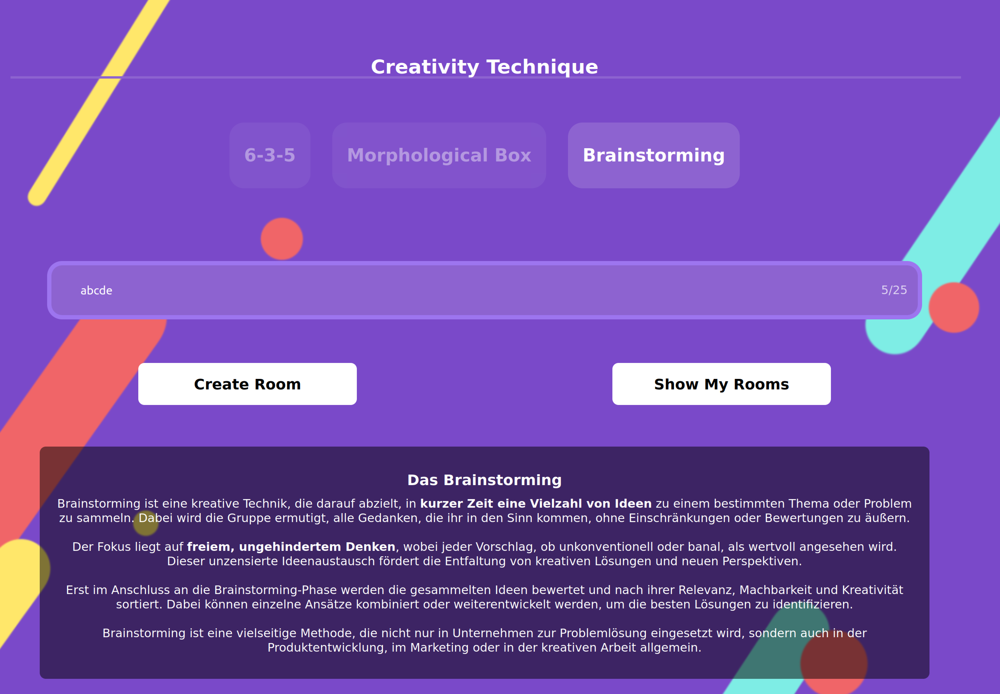

==== Creativity-Technique
Beschreibungen und Umschaltung zu den verschiedenen Methoden.
Eingabe eines Raumnames und die Möglichkeit zum Anlegen (Create) oder zum Wechsel in die Room-List.

=== Room-List

Zeigt die Liste der Räume des Benutzers an (also nur Räume, die der Nutzer angelegt hat).

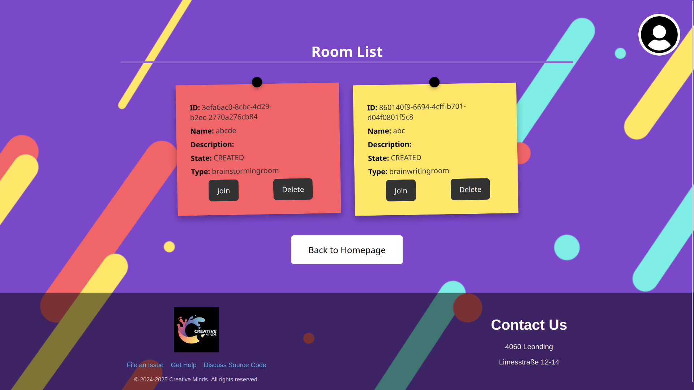

=== Stateful-Room

Wenn man einen Raum betritt (über einen Link, die Anlage eines Raumes oder über die Auswahl eines Raumes in der Roomlist), dann wird der Stateful-Room aktiv. In dem Raum wird zwischen den Raumtypen umgeschaltet und die zuständige Komponente je nach Typ aktiviert:

* Brainwriting
* Brainstorming
* Morphological

Hier der wichtigste Codeteil:

 template (roomType:string, roomId:string, userId:string) {
     return html ` <!-- Room ${roomId} User ${userId} -->
         ${(roomType === "brainwritingroom") ?
         html ` <brainwriting-element></brainwriting-element>` : nothing }
         ${(roomType === "brainstormingroom") ?
         html ` <brainstorming-element></brainstorming-element>` : nothing }
         ${(roomType === "morphologicalroom") ?
         html ` <morphologicalbox-element></morphologicalbox-element>` : nothing }
         ${(roomType === "otherroom") ? html `
             
otherroom

         ` : nothing }
         ${(roomType) ? nothing :
         html `
             
NO ROOM Found

             `}
         `;
 }

=== Brainwriting-Element

Implementierung der Methode 6-3-5 im Frontend. Es werden während der Raum startet nur die eigenen Ideen gezeigt. Keine anderen. Erst wenn der Raum stoppt, kann man die Ideen sehen.

Komponenten:

* Verwendet den *Room-Input* zur Eingabe von Namen und/oder Beschreibung des Raums.
* Verwendet die *Idea-List* für die Ideensammlung.
* Verwendet den *Text-Input* für die Eingabe von neuen Ideen.
* Verwendet die *Participant-List* zur Anzeige der User im Raum.

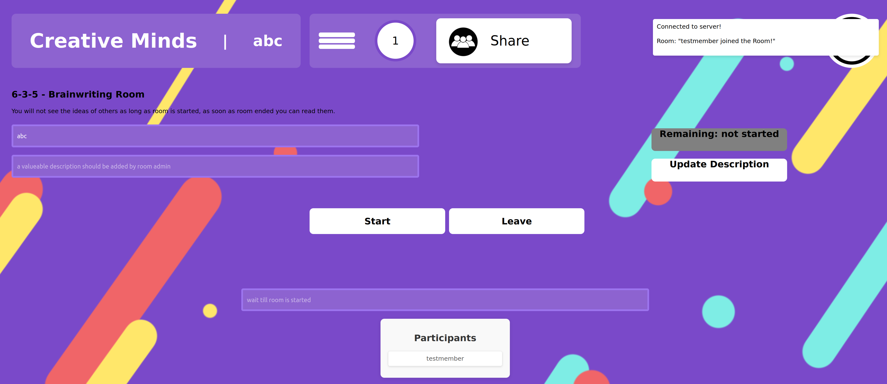

=== Brainstorming-Element

Implementierung der Brainstorming-Methode im Frontend. Es werden immer alle Ideen aller beteiligten Benutzer gezeigt.

Komponenten:

* Verwendet den *Room-Input* zur Eingabe von Namen und/oder Beschreibung des Raums.
* Verwendet die *Idea-List* für die Ideensammlung.
* Verwendet den *Text-Input* für die Eingabe von neuen Ideen.
* Verwendet die *Participant-List* zur Anzeige der User im Raum.

=== Room-Input

Veränderung (wenn Ersteller bzw. Admin) bzw. nur Anzeige von Raum-Informationen (Name, Beschreibung).

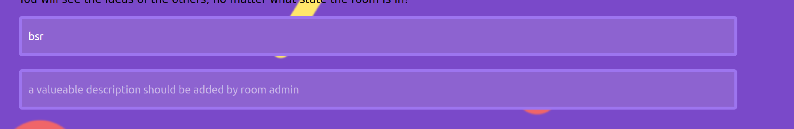

Enthält auch die Bedienelemente zum Start bzw. Stop des Raum-Countdowns und die Informationen zur Restzeit.

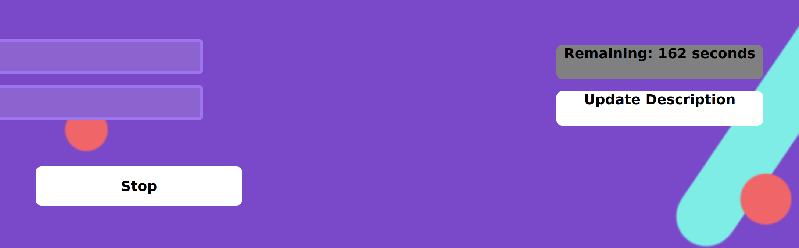

=== Idea-List

Anzeige der (sichtbaren) Ideen im Raum.

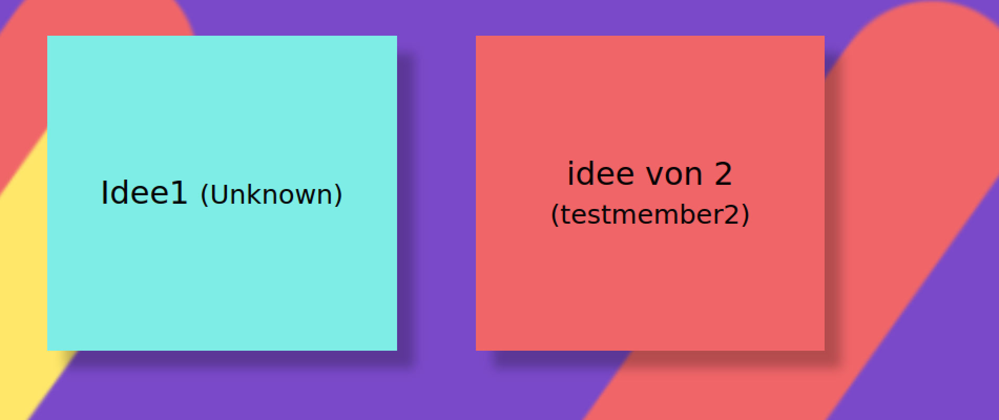

=== Text-Input

Eingabe von neuen Ideen in den Raum (nur wenn erlaubt, aktiver Raum, Limits).

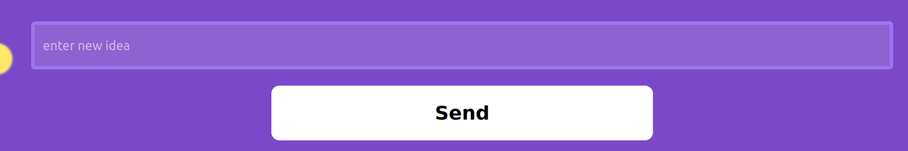

=== Participant-List

Liste der aktiven Nutzer im Raum.

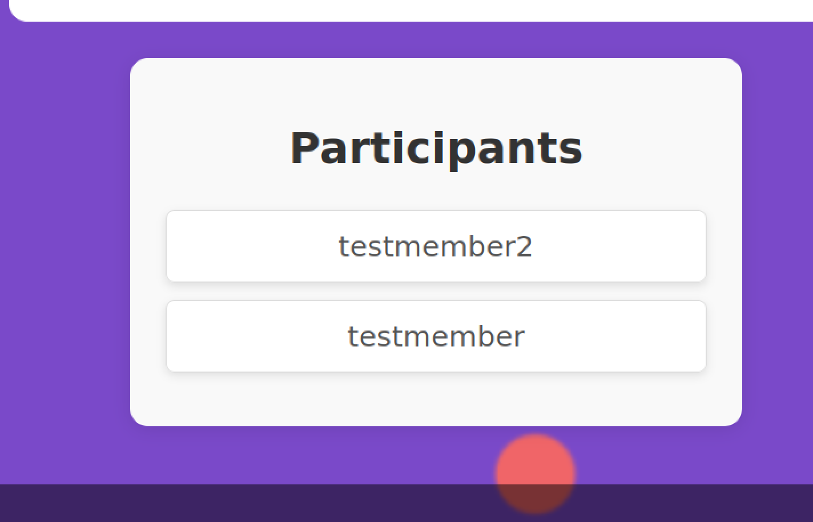

=== Morphological-Element

Besteht aus mehreren Stufen:

* morphologicalbox-element enthält die bereits verwendete
    ** *Room-Info-Menu* Komponente und
    ** die eigentliche *morphological-box*

* morphological-box enthält die eigentliche Implementierung

In einer Tabelle werden die Ideen über Parameter und Realisierungen eingeteilt, dann kann man in jedem Parameter jeweils eine Realisierung auswählen und mit `Save Combination` diese Kombination ins Backend speichern. Die Kombinationen sind die eigentlichen Ideen. (siehe auch das Konzept des Morphologischen Kastens unter https://de.wikipedia.org/wiki/Morphologische_Analyse_(Kreativit%C3%A4tstechnik%29 )

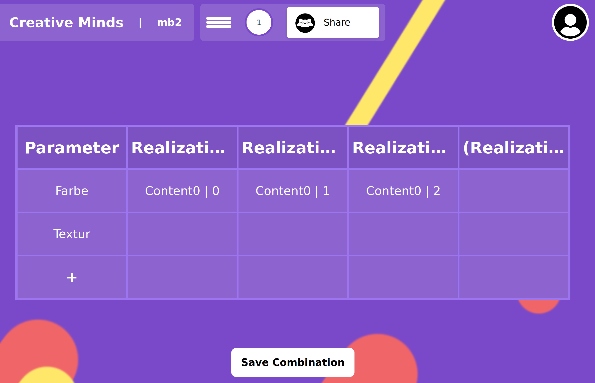

Bearbeitung einer Realisationen

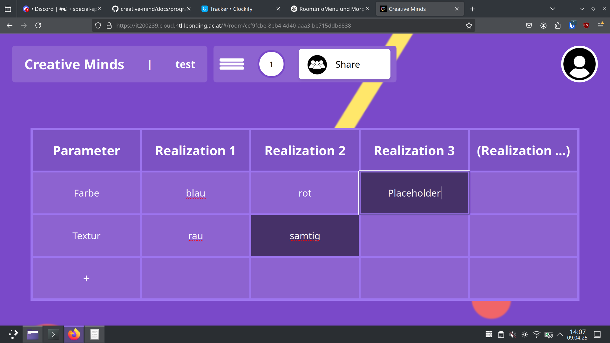

Auswahl der Realisationen zur Abspeicherung der Kombination

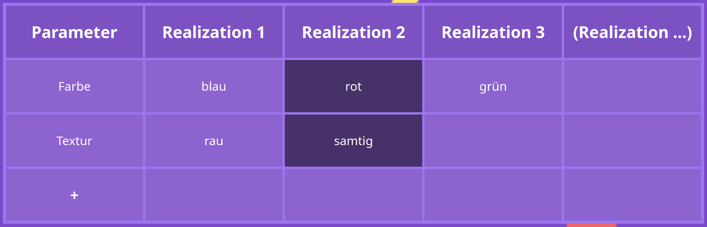

Abgespeicherte Kombinationen sehen dann so aus.

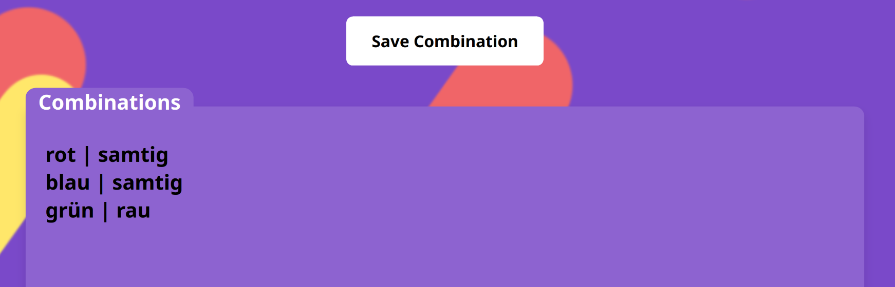

=== Room-Info-Menu

Beinhaltet eine Implementierung eines Hamburger-Menüs.

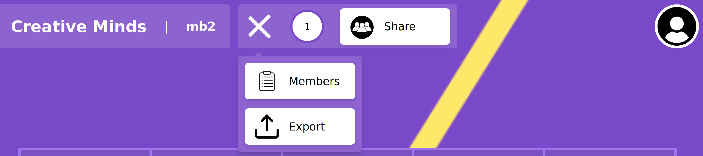

Beim Klick auf Members werden die Mitglieder des Raumes angezeigt

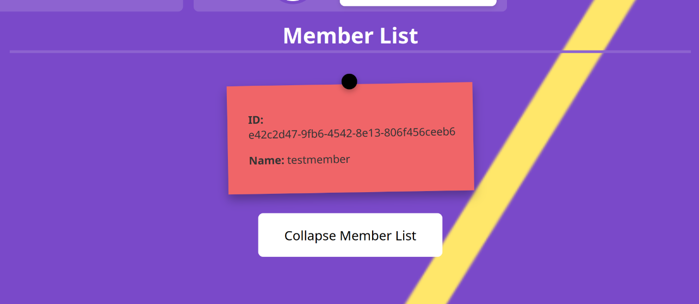

Beim Klick auf Share wird der Link in die Zwischenablage kopiert

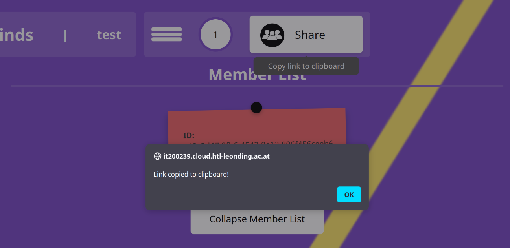

=== Room-Manager-Socket

Hat zwei Aufgaben:

. Kommunikation mit dem `Websocket` (siehe xref:websocket.adoc[Websocket]), wenn in einem Raum
. Toast-Messages bei Socket oder auch anderen Meldungen des Frontend (können durch `pushOneMessage` von anderen Komponenten "gepusht" werden)

== Das Model

Alle Klassen der Entitäten des Backend wurden als interfaces implementiert.

Das SSOT Model enthält folgende Informationen

 export interface Model {
    readonly ideas: Idea[],
    readonly rooms: Room[],
    readonly users: User[],
    readonly participations: Participation[],
    readonly activeRoomId : string,
    readonly thisUserId : string,
    readonly isRoomList : boolean,
    readonly parameters: MBParameter[],
    readonly combinations: MBCombination[],
    readonly remaining : number | null
 }

Sobald ein User angemeldet ist wird seine UserId in thisUserId eingetragen. Das System weiß, dass der Login erfolgt ist. Solange weder isRoomList noch `activeRoomId` gesetzt ist, befindet sich der User in der Anmelde/Raumanlage-Maske.

Sobald der Benutzer in die RoomList wechselt, ist `isRoomList` auf `true`, es kann keine `activeRoomId` gesetzt sein.

Sobald der User in einen Raum wechselt (durch Anlage, Link oder Auswahl aus der Liste) wird `isRoomList` auf `false` gesetzt und die `roomId` in `activeRoomId` gesetzt.

Alle Räume werden in `rooms` geladen. Alle Ideen eines Raums (falls es ein IdeaRoom also Brain*Room ist) werden in die `ideas` geladen.

== Die Services

=== idea-service

Erzeugung und Abrufen von Ideen in den Ideen-Räumen (Brain*Rooms). Kommunikation mit der REST-API vom Backend unter `/api/ideas`.

=== keycloak

Initialisierung der Verbindung zu Keycloak beim Aufruf, danach das Handling von Login bzw. Logout eines Users. Das Token wird hier generiert und in den Store/Model (SSOT) gelegt.

=== morpho-service

Kommuniziert mit dem REST-API vom Backend für den morphologischen Raum (`/api/morpho`) insbesondere:

* `/api/morpho/parameter`: für die Erstellung und Änderung von Parametern (Zeilen)
* `/api/morpho/realization`: für die Erstellung und Änderung von Realisationen (Feldern)
* `/api/morpho/combination`: für die Erstellung von Kombinationen

=== participation-service

Kommuniziert mit dem REST-API vom Backend für die Participations. (`/api/participations/room/\{id\}`) vor allem um die anderen Teilnehmer in einem Raum abzufragen.

=== room-service

Kommuniziert mit dem REST-API vom Backend für die Räume (`/api/rooms`):

* createRoom: einen Raum erzeugen (POST auf `/api/rooms/create`)
* updateRoom: einen Raum verändern (vor allem die Beschreibung oder den Namen, PUT auf `/api/rooms/update/\{roomId\}`)
* startRoom: startet die zeitabhängigen IdeaRooms (Brain*Room) um den RoomManager im Backend zu starten und die Eingabe von Ideen zu ermöglichen (PUT auf `/api/rooms/start/\{roomId\}`)
* stopRoom: stoppt den Raum vorzeitig (Beendet die Ideeneingabe, PUT auf `/api/rooms/stop/\{roomId\}`)
* getRoom: Raum lesen
* deleteRoom: derzeit noch nicht ins Service gewandert (noch in der RoomList implementiert!)

=== service-const

Konstanten für die Services:

* `path`: Adresse des Backend (dev: localhost, prod: am server)

=== user-service

Anlage und Abrufen von User-Informationen teilweise von Keycloak weitergegeben.
