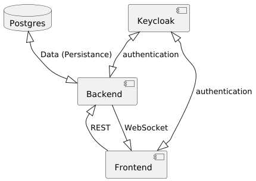

= Systembeschreibung

== Komponenten des Systems

* xref:./datenbank.adoc[Die Datenbank]: Eine Postgres Datenbank.

* xref:./backend.adoc[Das Backend]
    ** *Rest-API*: Abruf der Daten aus der Datenbank
    ** *WebSockets*: Der RoomManager im Backend verteilt "Neuigkeiten" an alle beteiligten Frontends in einem Raum.

* **Keycloak**
    ** Authentifizierung der User gegen das Frontend
    ** Anlage bzw. Registrierung von neuen Usern
    ** Übergabe der Token an das Backend und die Authentifizierung über die Quarkus-Keycloak Funktionalität

* xref:./frontend.adoc[Das Frontend]
    ** Lit-Komponenten auf Basis der benötigten Funktionen
    ** Services für die API und die WebSockets
    ** Keycloak-handling über Keycloak-Service

