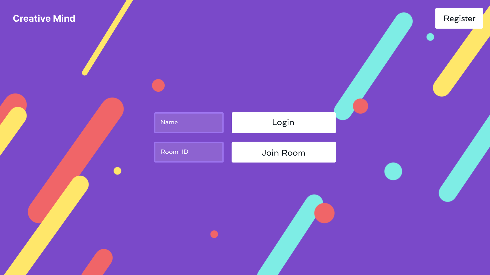
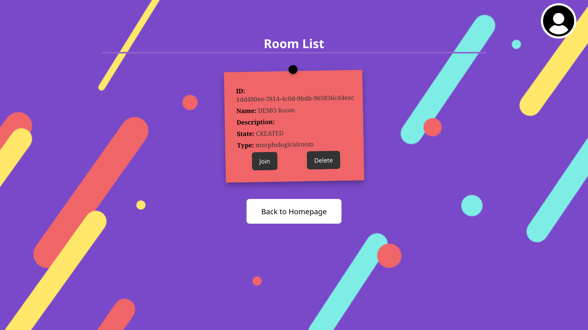
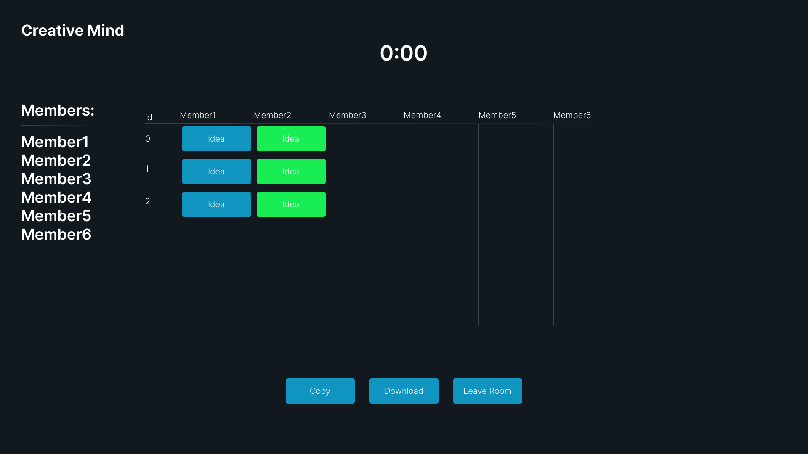

= Creative-Mind Wireframe
Christoph Ursprung
1.0.0, {docdate}
//:toc-placement!:  // prevents the generation of the doc at this position, so it can be printed afterwards
:icons: font
:sectnums:
:toc: left
:experimental:

=== Link zum Wireframe
https://www.figma.com/file/dM3qG2VB9eYjCiUFSOzOit/Creative-Minds---Wireframe?type=design&node-id=0%3A1&mode=design&t=TQcbbbunzxwIeFKL-1[Wireframe]

=== Wireframes als PNG

Homepage (Login/Join Room)

Homepage (Register/Create Room)
image:./img/Wireframe_HomeWhenClickedOnRegister.png[]

Brainstorming (laufender Raum mit Ideen)

Morphological Box (Raum mit Parameter und Realizations)
image:./img/Wireframe_MorphologicalBox.png[]

Morphological Box (Raum bevor man Realizations ausgewählt hat)

Morphological Box (Raum nachdem man Realizations ausgewählt hat)

Morphological Box Share per QR (Raumeinladung durch QRCode)
image:./img/Wireframe_MorphologicalBox_SharePerQR.png[]

Room List (Liste aller Räume)

6-3-5 Methode bevor Start des Timers als Room Admin (Brainwriting)

6-3-5 Methode währrend man als Member wartet (Brainwriting)

6-3-5 Methode nach Start des Timers (Brainwriting)

6-3-5 Methode nachdem die Zeit abgelaufen ist (Brainwriting)
